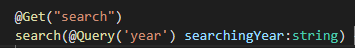
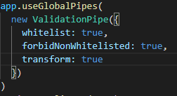

# NestJs

### NestJs 란 ExpressJs 위에서 사용할 수 있는 서버 프레임워크 이다.

#### 보통 TypeScript 와 NodeJs 기반으로 사용된다

```javascript
npm i -g @nestjs/cli
nest new (project-name)
// 으로 프로젝트 생성
```

# Controller

### controller 란 ExpressJs 기준으로 Router 의 개념

```javascript
nest g co 
// 로 생성이 가능하며 명령어 실행 시 컨트롤러의 이름을 물어봄

@Controller('컨트롤러 명')
// class 형 이다
export class MoviesController {
  // 접근 방식
  @Get()
  // 함수명 (아무거나)
  getAll() {
    // 리턴할 값
    return "This will return all movies"
  }
}
// 해당 코드처럼 적어준다면 localhost:3000/(컨트롤러 명) 으로 접근한 경우 "This will return all movies 를 return 함"

@Get("/:id")
  // 파라미터는 @Param('') 으로 받아온다
  getOne(@Param('id') id: string) {
      return `This will return one movie with the id : ${id}`
  }
// 접근 방식과 실행할 함수는 붙어있어야한다!
```

#### Query 는 해당 이미지 처럼 @Query('쿼리명') 으로 받아와 사용이 가능하다



# Service

#### NestJs Service 란 Controller 에게 함수를 전달하는 JS 파일로 해당 파일에서 실질적인 함수를 export 한다

```javascript
nest g service
// 로 설치가 가능하다
```


# Pipes

```javascript
  app.useGlobalPipes(
    new ValidationPipe({
      // 받는 데이터에 제한을 주는 옵션들을 넣을 수 있음
      whitelist: true
      // whitelist : true 를 하게되면 원하는 타입에 값이 없는경우 오류를 return 해줌
      transform: true
      // transform: true 를 하는경우 원하는 타입의 값이 다른 타입일 경우 자동 변환해줌
    })
  )
```



```javascript
class (클래스 명) extends (상속받을 클래스) {
  // 로 해당 클래스의 속성을 상속받을 수 있다
}
```

# Fastify

#### fastify 란 expressJs 와 같이 동작하지만 2배 이상 빠른 프레임워크 이다.


# Spect

```javascript
// spect.ts 파일에선 검사를 진행한다 아래와 같은 경우 expect(조건)이 .toEqula(4 ) 와 맞는지 검사 후 True OR False 를 반환해준다.
it("should be 4" , () => {
  expect(2+2).toEqual(4)
})
```

